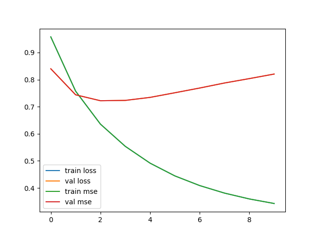
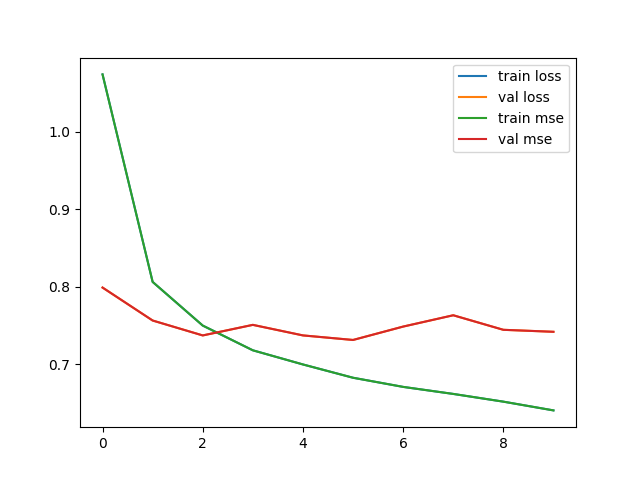
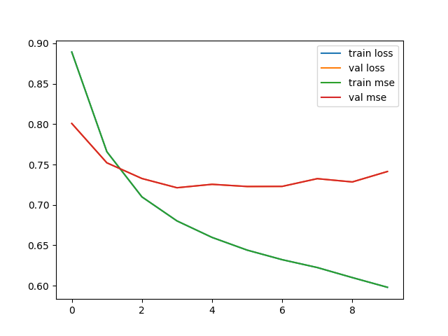
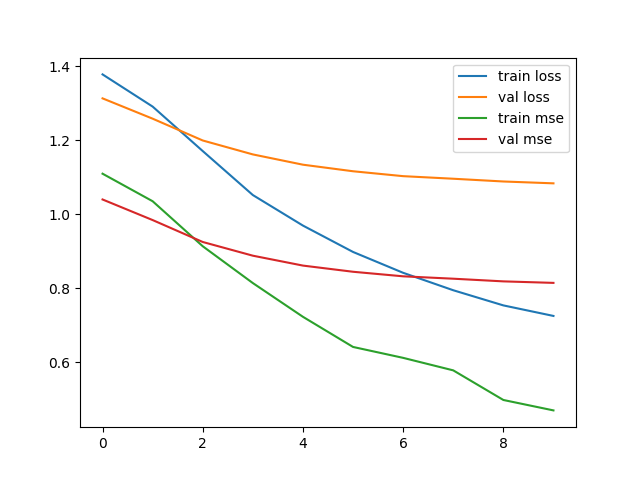

# Movie Recommender System

Today, I’m excited to share my journey of building a movie recommender system using the MovieLens dataset. In this project, I experimented with several techniques, including collaborative filtering, matrix factorization, and AutoRec. After rigorous testing and tweaking, I found that the deep learning implementation of matrix factorization delivered the best results. It outperformed the other methods by a significant margin. 

## Data

I used a smaller chunk of the MovieLens dataset available from TensorFlow datasets. This dataset is rich with user ratings for various movies, making it perfect for building a recommender system. To efficiently manage and utilize this data, I parsed it into three dictionaries:

1. user2movie: Maps each user to the movies they have rated.
2. movie2user: Maps each movie to the users who have rated it.
3. usermovie2ratings: Stores the actual ratings that users have given to movies.

For the AutoRec model, I created a sparse representation of the user-movie matrix and the ratings matrix. This representation is crucial for AutoRec as it leverages neural networks to predict missing ratings.
When it came to Matrix Factorization, the process was even more straightforward. Since I used Keras embeddings, I didn’t need to transform the data in any specific way. The embeddings handled the data representation internally, allowing for a more seamless integration into the model.
With the data organized and prepped, I was ready to dive into the modeling phase.

## Model Building and Training

Building and training the movie recommender system was an experiment in itself. I explored three different models: Collaborative Filtering, Matrix Factorization, and AutoRec. Each model brought its own challenges and learning experiences. Here's a detailed look at how each model performed.

### Collaborative Filtering

**User-based Collaborative Filtering:** This model focused on finding similarities between users to predict ratings. It was relatively quick to train and produced decent results.

- Train MSE: 0.6882
- Test MSE: 1.0906

**Item-based Collaborative Filtering:** Contrary to expectations, this model took longer to train compared to the user-based approach and did not perform as well. Despite literature suggesting item-item models can be faster and more accurate, my results differed.

- Train MSE: 2.2444
- Test MSE: 4.4829

### Matrix Factorization

**Simple Matrix Factorization:** Implemented using TensorFlow and Keras, this model was trained for 10 epochs with a batch size of 32. The model used Mean Squared Error (MSE) as the loss function and Adam as the optimizer. The training and validation metrics showed a steady decrease in loss and MSE initially, but started to plateau and slightly increase towards the end.

**Matrix Factorization with Deep Learning:** This approach extended the matrix factorization model with deep learning techniques such as dense layers, dropout, batch normalization, and ReLU activation. Trained with Stochastic Gradient Descent (SGD) optimizer with a learning rate of 0.01 and momentum of 0.9, the model showed a balanced improvement over the epochs.

**Matrix Factorization with Residual Networks:** Combining the simplicity of matrix factorization with the power of deep learning, I introduced residual connections to improve the learning capability. This hybrid model also used the SGD optimizer with similar parameters and showed promising results.

### AutoRec

For the AutoRec model, I used a sparse representation of the user-movie matrix. Building custom train and test data generators that utilized masking to focus the model on relevant data points was crucial. A custom loss function was implemented, and the model was trained with the SGD optimizer (learning rate of 0.08, momentum 0.9) for 10 epochs.

Each model brought its own strengths and weaknesses, but the deep learning-enhanced matrix factorization models consistently performed well, striking a balance between accuracy and training time. This detailed experimentation provided valuable insights into the nuances of building effective recommender systems.

## Conclusion

In the end, my goal was to build a robust movie recommender system. Through experimenting with various techniques—Collaborative Filtering, Matrix Factorization, and AutoRec—I gained valuable insights into their strengths and limitations. The results clearly indicated that Matrix Factorization, when enhanced with deep learning capabilities, serves as a superior approach for generating accurate and reliable movie recommendations. This method showed significant promise and efficiency, making it a strong candidate for deployment on a server for real-time recommendations. Given its performance, Matrix Factorization with deep learning should definitely be considered for real-world applications in movie recommendation systems.
